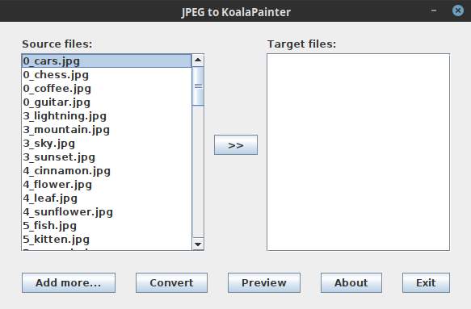

JPEG to KoalaPainter
====================

`jpg2kla` is a simple graphic format converter utility wrapped by a simple GUI.

VERSION
-------

Version 0.02-SNAPSHOT (2021-01-01)

INSTALLATION
------------

### Build from sources

Add the following automatic export to your `~/.bash_profile`:

    export _JAVA_OPTIONS="-Xms1024m -Xmx2G -Xss256m"

In order to build and run an application JAR type the following:

    $ git clone git://github.com/pawelkrol/jpg2kla.git
    $ cd jpg2kla
    $ sbt clean update compile test package proguard:proguard run
    $ java -Dfile.encoding=UTF8 -jar target/scala-2.13/proguard/jpg2kla-0.02-SNAPSHOT.jar

### Download precompiled binaries

Double-click `jpg2kla-0.01.jar` or type in a terminal window:

    $ java -Dfile.encoding=UTF8 -jar jpg2kla-0.01.jar

COPYRIGHT AND LICENCE
---------------------

Copyright (C) 2021 by Pawel Krol.

This library is free open source software; you can redistribute it and/or modify it under [the same terms](https://github.com/pawelkrol/ScalaSwing-HelloWorld/blob/master/LICENSE.md) as Scala itself, either Scala version 2.13.4 or, at your option, any later version of Scala you may have available.
